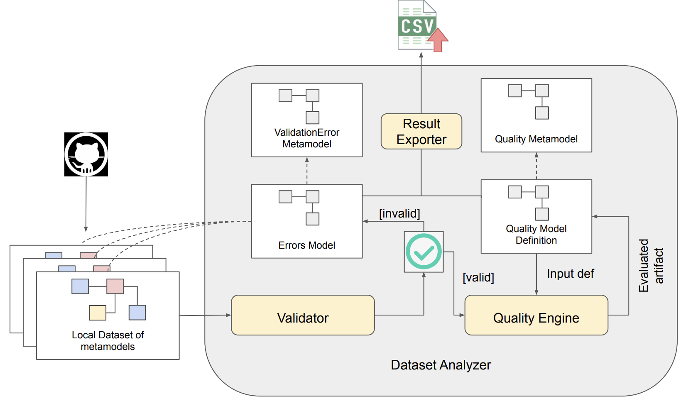
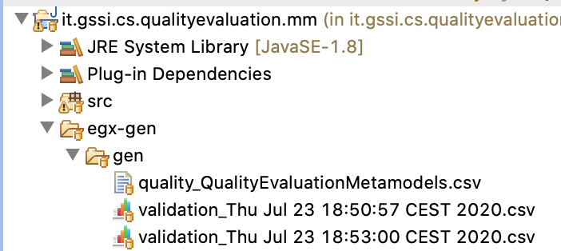

# Repository Evaluation ToolChain
This project includes the toolchain we have used to automatically characterize a dataset of 2,418 metamodels made available for reuse. 
The result of the analysis is available at https://docs.google.com/spreadsheets/d/1rJF7EPcGQB7tENeo3XYS2unwD5da7u3u3PJ0TKta0ew/edit?usp=sharing 

## Scope of the presented tool
Given a set of metamodels in input, the toolchain can generate a CSV file reporting several characteristics of the analyzed metamodels i.e.
possible well-formedness violations (and related severity) and the values of  quality metrics automatically measured on the input metamodels. 
Thus, users can make use of the produced CSV file to filter out those metamodels that satisfy the characteristics that are of interests for the experiments to be executed.

##Execution flow and testing
In order to test the tool chain please follow these steps:
1 - Run /it.gssi.cs.qualityevaluation.mm/src/it/gssi/cs/quality/test/TestApp.java and this test method will execute the tool chain on the given folder of metamodels /it.gssi.cs.qualityevaluation.mm/examples
This folder contains 4 metamodels for testing.

2 - The result of the execution will be visible in the /it.gssi.cs.qualityevaluation.mm/egx-gen/gen folder

